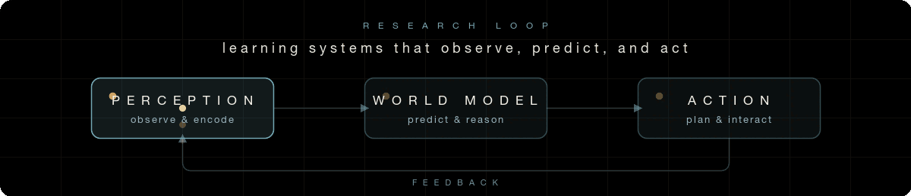

  

<h1 align="center">Junqi Jing 荆浚淇</h1>

  Undergraduate researcher in Software Engineering 
  <strong>Harbin Institute of Technology</strong>

  <a href="https://yuankjing.github.io/JunqiJing/">Research homepage</a>
  ·
  <a href="mailto:2023210913@stu.hit.edu.cn">Email</a>

  <em>World Models · Embodied AI · Robot Learning</em>

---

## About

I am an undergraduate student in Software Engineering at **Harbin Institute of
Technology**. My research centers on learning systems that connect perception,
prediction, and action for embodied intelligence.

I am currently an **AI Research Intern at
[KNOWIN AI](https://www.knowinai.com/)**, working on dexterous-hand manipulation
with Vision-Language-Action models and exploring **World Action Models**.

Previously, I studied at **POSTECH** as an exchange student and conducted
research in the [MLV Lab](https://sites.google.com/view/mlvlab/home?authuser=0)
under [Prof. Kwang In Kim](https://sites.google.com/view/kimki). After returning
to China, I joined **Tsinghua University** as a visiting student in the
[LEAP Lab](https://www.leaplab.ai/), guided by
[Prof. Gao Huang](https://gaohuang-net.github.io/).

## Research focus

- **World and action models** — learning action-conditioned representations
  for prediction, planning, and adaptation.
- **Embodied intelligence** — grounding vision, language, and control in
  interactive physical systems.
- **Dexterous manipulation** — acquiring robust, generalizable skills for
  multi-fingered hands.
- **Foundation models for robotics** — using VLA and language models for
  reasoning and decision-making beyond static perception.

## Research experience

**KNOWIN AI** · *AI Research Intern* 
Vision-Language-Action models, World Action Models, and dexterous-hand
manipulation.

**POSTECH · MLV Lab** · *Exchange Research Student* 
Research under the supervision of
[Prof. Kwang In Kim](https://sites.google.com/view/kimki).

**Tsinghua University · LEAP Lab** · *Visiting Student* 
Research visit under the guidance of
[Prof. Gao Huang](https://gaohuang-net.github.io/).

## Toolbox

`Python` · `C++` · `Java` · `PyTorch` · `CUDA` · `ROS 2` · `Linux` · `Git`
· `LaTeX`

---

## Contact

I am always happy to discuss embodied intelligence, robot learning, and
collaborative research. Visit my
**[research homepage](https://yuankjing.github.io/JunqiJing/)** or reach me by
**[email](mailto:2023210913@stu.hit.edu.cn)**.

  Perception → prediction → action.

