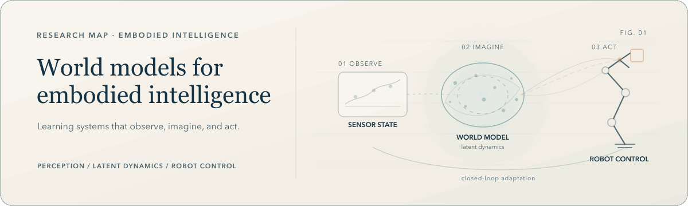

<h1 align="center">Junqi Jing · 荆浚淇</h1>

  <strong>Undergraduate Researcher in Software Engineering</strong> 
  Harbin Institute of Technology · AI Research Intern at
  <a href="https://www.knowinai.com/">KNOWIN AI</a>

  <a href="https://yuankjing.github.io/JunqiJing/">Research Homepage</a>
  &nbsp;·&nbsp;
  <a href="https://scholar.google.com/citations?user=EFVJ4AkAAAAJ&amp;hl=en">Google Scholar</a>
  &nbsp;·&nbsp;
  <a href="mailto:xingkong8527@gmail.com">Email</a>

  <em>World Models · Embodied AI · Robot Learning</em>

  <picture>
    <source
      media="(prefers-reduced-motion: reduce) and (max-width: 600px)"
      srcset="./assets/research-hero-mobile.png"
    />
    <source
      media="(prefers-reduced-motion: reduce)"
      srcset="./assets/research-hero.png"
    />
    <source
      media="(max-width: 600px)"
      srcset="./assets/research-hero-mobile.gif"
    />
    
  </picture>

> **Open to research internships.** I am interested in opportunities related to
> embodied AI, world models, and robot learning, and I would be glad to connect
> with research teams at leading technology companies.

## Research

- **World and Action Models** — learning action-conditioned representations
  for prediction, planning, and adaptation.
- **Vision-Language-Action and Embodied Robot Learning** — grounding visual and
  language representations in interactive physical systems.
- **Dexterous Manipulation** — developing robust and generalizable skills for
  multi-fingered hands.

## Current

At **[KNOWIN AI](https://www.knowinai.com/)**, I work on dexterous-hand
manipulation with Vision-Language-Action models and explore
**World Action Models** for embodied intelligence.

## Background

- **[POSTECH · MLV Lab](https://sites.google.com/view/mlvlab/home?authuser=0)**
  · *Exchange Research Student* 
  Conducted research under
  [Prof. Kwang In Kim](https://sites.google.com/view/kimki).

- **[Tsinghua University · LEAP Lab](https://www.leaplab.ai/)**
  · *Visiting Student* 
  Conducted research under the guidance of
  [Prof. Gao Huang](https://gaohuang-net.github.io/).

## Technical toolkit

**Languages** — `Python` · `C++` · `Java` 
**ML and acceleration** — `PyTorch` · `CUDA` 
**Robotics and systems** — `ROS 2` · `Linux` · `Git` 
**Scientific writing** — `LaTeX`

---

## Connect

For research internship opportunities, technical discussions, or
collaboration—particularly with industrial research teams working on embodied
intelligence—reach me at
**[xingkong8527@gmail.com](mailto:xingkong8527@gmail.com)** or visit my
**[research homepage](https://yuankjing.github.io/JunqiJing/)**.
